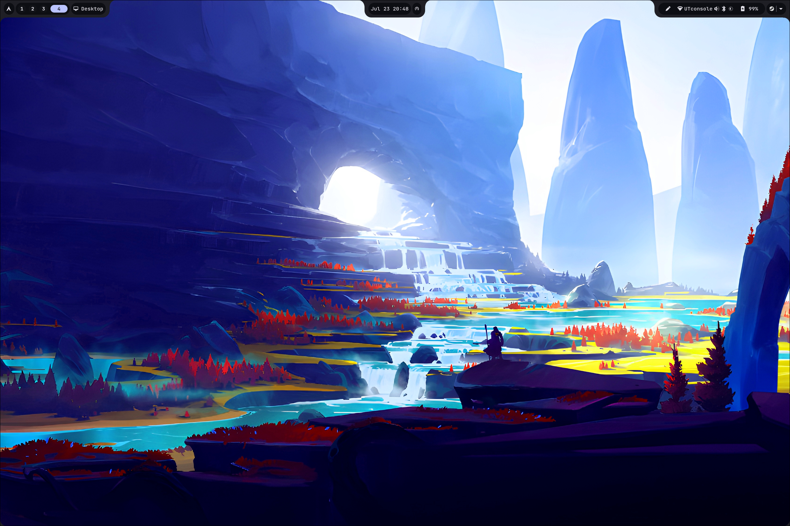

# Lunur-Shell


<div align=center>
  


</div>

> [!WARNING]  
> This is in active development

## Screenshots

<table align="center">
  <tr>
    <td colspan="4"></td>
  </tr>
</table>

As of 8/3/25

## Installation

> [!NOTE]
> You need a functioning Hyprland installation.

Clone the repo:

```
  git clone https://github.com/dianaw353/Lunur-Shell.git ~/.config/Lunur-Shell
  cd ~/.config/Lunur-Shell/
```
### Option 1: Automated Installation

#### Step 1: Run the script

Run the following script

```
  ./install_requirements.sh
```

#### Step 2: Run the python program

```
  python main.py
```

### Option 2: Manual Installation

#### Step 1: Install Dependencies - Arch Linux

Run the following command to install the required system packages:
```
  yay -S --noconfirm --needed fabric-cli-git python-fabric-git dart-sass libnotify python-pyjson5 python-pytomlpp upower gray-git networkmanager bluez bluez-utils tela-circle-icon-theme-standard hyprpicker wl-clipboard cliphist noto-fonts-emoji gnome-bluetooth-3.0 python-ijson tela-circle-icon-theme-standard figlet playerctl
  sudo pacman -U https://archive.archlinux.org/packages/p/python-gobject/python-gobject-3.50.0-2-x86_64.pkg.tar.zst 
```
> [!NOTE]
> It's required to add `python-gobject` package to the `IgnorePkg` variable on `/etc/pacman.conf`. Failure to do so will crash the shell upon upgrading the said package until the downgrade is performed again.

#### Step 2: Run the python program

```
  python main.py
```

## Roadmap

- [x] App Launcher
- [x] Workspaces
- [x] Window Title
- [x] Date/Time
- [x] Calender
- [x] Battery
- [ ] Network Manager
- [ ] Bluetooth Manager
- [x] Clipboard Manager
- [x] Power Manager
- [ ] Power Menu
- [x] Color Picker
- [ ] QuickSettings (in progress)
- [x] Notifications
- [x] System Tray
- [x] Keybind Cheat Sheet
- [ ] Screen Recorder
- [ ] Screenshots
- [ ] OCR
- [ ] OSD
- [x] Emoji Picker
- [ ] Media Player (half done)
- [ ] Matugen theme (in progress)

## Sister Projects

[Lunur-Dots](https://github.com/dianaw353/Lunur-Dots)
